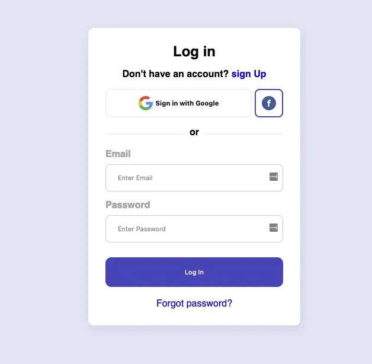
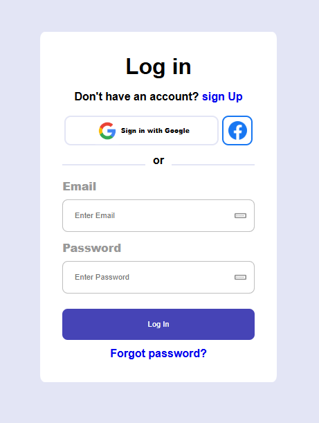

# Login Form UI

Este es un proyecto sencillo de una interfaz de **formulario de inicio de sesión** diseñado con **HTML5 y CSS3**. Incluye botones de acceso con Google y Facebook, una opción para registrarse, recuperar la contraseña y campos para email y contraseña.

---

## 🚀 Vista previa



---

## 🛠️ Tecnologías usadas

- HTML5
- CSS3
- Flexbox
- Tipografías del sistema (`Segoe UI`, `Tahoma`, `Verdana`)

---

## 📁 Estructura del proyecto

```📦 Proyecto │
├── index.html   # Estructura HTML del formulario
├── style.css    # Estilos del formulario
└── assets/
    └── images/
        ├── google_13170545.png
        ├── facebook_5968764.png
        ├── Modelo.webp
        └── Captura.png
```

---

## ✨ Funcionalidades

- Botón de inicio de sesión con Google y Facebook.
- Separador visual con la palabra "or".
- Formulario básico de email y contraseña.
- Diseño limpio y moderno, responsivo y centrado.
- Accesos directos para registro y recuperación de contraseña.

---

## 📸 Capturas



---

## 🔧 Personalización

Si deseas personalizar colores, imágenes o tipografía, puedes modificar directamente el archivo `style.css` según tus necesidades.

---

## 🤝 Autor

[Paula Calvo](https://github.com/PCalvoGarcia "Ir a github") 💻
